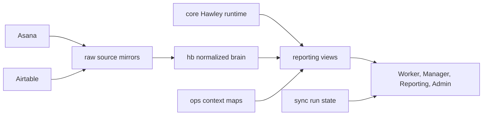

# Hawley Database Schema Map

Last updated: 2026-07-13

This file describes the Postgres shape defined by `db/migrations` and `db/views`.
It is the working map for expanding Hawley's shop-floor context.

## Design Layers

Hawley should read from the highest trustworthy layer available:

1. `reporting`: app-ready read models and analysis views.
2. `hb`: Hawley Brain normalized shop model and persisted calculations.
3. `core`: Hawley-owned runtime events, sessions, account state, and reviews.
4. `ops`: operational mapping and capability context.
5. `raw`: mirrored source payloads from Airtable and Asana.
6. `sync`: ingestion, migrations, run history, and writeback queues.

`calc` exists as a reserved schema, but no active tables are currently defined there.

## Cycle Calendar Rule

Cycle days are shop workdays, not calendar days.

- Workdays are Monday through Friday.
- Holidays come from `hb.cycles.holidays`.
- `hb.cycles.days_in_cycle` is computed from `start_date`, `end_date`, and holidays during HB rebuilds.
- Manager day rails should use computed workday dates from the cycle date range, not arbitrary selected dates.
- Example: C12 starts Friday, July 10, 2026 and runs through Wednesday, July 22, 2026. That is 9 workdays, not 10, because Saturday and Sunday are not workdays.

## Schemas

### `raw`

Purpose: loss-preserving mirrors of external systems. These tables are not the preferred read surface for app logic unless no normalized HB/core model exists yet.

| Table | Source | Key | Role |
| --- | --- | --- | --- |
| `raw.airtable_schema_tables` | Airtable metadata API | `table_id` | Captures Airtable table metadata. |
| `raw.airtable_schema_fields` | Airtable metadata API | `table_id`, `field_id` | Captures Airtable field metadata, including fields not used by import filters. |
| `raw.airtable_task_instances` | Airtable `Task Instances Rev1` | `record_id` | Legacy Rev1 production ledger mirror. |
| `raw.airtable_tasks` | Airtable `Tasks` | `record_id` | Task template source for project creation. |
| `raw.airtable_production` | Airtable `Production` | `record_id` | Production schedule source for project creation. |
| `raw.airtable_vins` | Airtable `VINs` | `record_id` | VIN model/frame context source for project creation. |
| `raw.airtable_models` | Airtable `Models` | `record_id` | Model and frame-class context source for project creation. |
| `raw.airtable_cycles` | Airtable `Cycles` | `record_id` | Cycle date and capacity source. |
| `raw.airtable_work_force` | Airtable `Work Force` | `record_id` | Employee roster, skill, phase, and availability source. |
| `raw.airtable_phases` | Airtable `Phases` | `record_id` | Phase, section, parity, and grouping source. |
| `raw.airtable_phase_cycle_load` | Airtable `Phase Cycle Load Rev1` | `record_id` | Legacy phase-cycle load mirror. |
| `raw.airtable_worker_phase_allocation` | Airtable `Worker Phase Allocation Rev1` | `record_id` | Legacy worker/phase/cycle allocation mirror. |
| `raw.airtable_worker_cycle_bank` | Airtable `Worker Cycle Bank Rev1` | `record_id` | Legacy worker cycle capacity bank mirror. |
| `raw.airtable_worker_daily_actuals` | Airtable `Worker Daily Task Actuals` | `record_id` | Legacy daily actuals mirror and backfill target. |
| `raw.asana_portfolios` | Asana API | `gid` | Portfolio mirror. |
| `raw.asana_portfolio_projects` | Asana API | `portfolio_gid`, `project_gid` | Portfolio project membership and type. |
| `raw.asana_projects` | Asana API | `gid` | Project mirror. |
| `raw.asana_tasks` | Asana API | `gid`, `project_gid` | Task mirror with full task JSON and custom fields. |
| `raw.asana_task_project_memberships` | Asana API | `task_gid`, `project_gid` | Multi-project task membership. |

### `hb`

Purpose: Hawley Brain. This is the preferred normalized shop model for scheduling, project creation, PLH-style dashboards, and worker-page context.

| Table | Grain | Writer | Role |
| --- | --- | --- | --- |
| `hb.work_force` | one worker | `pg:build:hb` | Normalized employee roster, phase, skill levels, efficiency, and hours per day. |
| `hb.cycles` | one production cycle | `pg:build:hb` | Cycle label, workday date range, computed day count, capacity, holidays, and progress. |
| `hb.phases` | one phase/section | `pg:build:hb` | Phase names, section columns, process order, parity, grouping, and model metadata. |
| `hb.rev1_task_instances` | one Rev1/Asana task instance | `pg:build:hb` | Main production task ledger. Airtable bootstraps it; Asana overlays live truth. |
| `hb.worker_daily_task_actuals` | one worker/task/day actual or summary | worker app, backfill, HB build | Actual logged minutes, WIP timer minutes, daily summaries, and capacity flags. |
| `hb.phase_cycle_load_rev1` | one phase/cycle load bucket | `pg:build:hb` | Remaining, completed, and total load by phase/cycle. Supports PLH-style debt and pacing. |
| `hb.worker_phase_allocation_rev1` | one worker/cycle/phase allocation | `pg:build:hb` | Assigned, imported, exported, and cross-phase support hours. |
| `hb.worker_cycle_bank_rev1` | one worker/cycle capacity bank | `pg:build:hb` | Worker cycle capacity, assigned hours, remaining hours, and effective bank. |
| `hb.task_templates` | one task template | `pg:build:hb` | Postgres task-template model sourced from Airtable `Tasks`, including the normalized `Required Skill Level`. |
| `hb.production_schedule` | one production schedule row | `pg:build:hb` | Postgres production schedule sourced from Airtable `Production`. |
| `hb.vins` | one VIN | `pg:build:hb` | Normalized VIN model and frame-class context for project creation. |
| `hb.models` | one model/frame row | `pg:build:hb` | Normalized model/frame reference table for template filtering. |
| `hb.project_creation_runs` | one admin create run | admin Project Creator | Audit/result table for Postgres-first Asana project creation. |
| `hb.phase_cycle_pace_overrides` | one cycle/phase pace overlay | admin Dashboard | Non-destructive true start date overlay for phase pacing. |

### `core`

Purpose: Hawley-owned runtime data. These are the tables Hawley can own directly without waiting for Airtable or Asana.

| Table | Grain | Role |
| --- | --- | --- |
| `core.task_instances` | one normalized early task instance | First generation normalized worker-page model. Mostly superseded by `hb.rev1_task_instances`. |
| `core.worker_task_sessions` | one legacy worker task session | Early worker-session table. |
| `core.worker_day_schedule` | one worker/day schedule | Scheduled hours and planned breaks used for utilization and capacity. |
| `core.assignment_events` | one assignment-change event | Assignment churn and dispatch context. |
| `core.worker_task_events` | one start/stop/complete event | Worker app event stream. |
| `core.time_sessions` | one timer session | Hawley-owned timer source for actual work sessions. |
| `core.task_transition_events` | one transition gap | Gap, category, review, and timer transition ledger. |
| `core.transition_reviews` | one manager review | Manager review write table for transition events. |
| `core.transition_gap_buckets` | one gap bucket config | Threshold and display metadata for gap classification. |
| `core.transition_category_catalog` | one review category | Category catalog for transition explanations. |
| `core.app_users` | one user account | Login identity, role, temporary password state, active flag. |
| `core.app_sessions` | one login session | Web session tokens. |
| `core.app_auth_events` | one auth event | Login/audit event trail. |
| `core.task_completion_evidence` | one worker contribution to one completed task instance | Historical task completion, timing, confidence, assistance, quality, and verification evidence. |
| `core.worker_task_capabilities` | one worker/task-template pair | Refreshable capability rollup with completion counts, median/recent timing, consistency, and verification state. |

### Admin-Owned Overlays

Admin overlays are Hawley-owned view controls, not source-system rewrites.

`hb.phase_cycle_pace_overrides` lets an admin define the true start date for a
phase inside a cycle. The Admin Dashboard uses this to calculate phase-specific
pace after management intentionally delays a phase start. It does not change the
production schedule, task estimates, worker actuals, Asana tasks, or Airtable
records.

`hb.project_creation_runs` records admin Project Creator attempts and results.
The creator writes native pending rows to `hb.rev1_task_instances` with
`source_system = 'hawley_project_creator'` before Asana creation, then stores the
resulting Asana project/task GIDs after success.

### `ops`

Purpose: shop context that helps Hawley infer ownership, work area, and capabilities.

| Table | Role |
| --- | --- |
| `ops.work_area_aliases` | Maps phase names, section names, task keywords, and aliases to work areas. |
| `ops.manual_work_area_owner_hints` | Human-entered owner hints for work-area ownership. |

### `reporting`

Purpose: stable app read surfaces. UI code should prefer these over raw tables when possible.

| View | Role |
| --- | --- |
| `reporting.daily_worker_assignments` | Early normalized daily assignment view. |
| `reporting.work_force_capability_levels` | Worker skill/capability rollup. |
| `reporting.task_work_area_inference` | Infers work area/phase from task data and aliases. |
| `reporting.assignee_work_history` | Historical worker/task/phase activity. |
| `reporting.work_area_owner_hints` | Combined owner hints. |
| `reporting.worker_capability_map` | Worker capability map by work area. |
| `reporting.work_area_owners` | Best owner/backup owner per work area. |
| `reporting.hawley_worker_page_assignments` | Main worker-page task assignment view. |
| `reporting.hawley_cycle_calendar` | Cycle calendar view backed by `hb.cycles`. |
| `reporting.worker_time_sessions` | Unified productive-time sessions from HB actuals and core sessions. |
| `reporting.transition_event_detail` | Enriched transition event ledger. |
| `reporting.worker_daily_utilization` | Worker/day productivity, efficiency, transition, and capacity rollup. |
| `reporting.worker_transition_summary` | Worker/day transition summary. |
| `reporting.worker_unaccounted_time` | Worker/day unaccounted time summary. |
| `reporting.phase_day_summary` | Phase/day utilization and work progress. |
| `reporting.worker_phase_day_summary` | Worker/phase/day detail. |
| `reporting.phase_worker_labor_detail` | Alias for worker/phase labor detail. |
| `reporting.assignment_churn_by_worker` | Assignment churn by worker. |
| `reporting.assignment_churn_by_phase` | Assignment churn by phase. |
| `reporting.queue_starvation_events` | Transition rows where no next task/lead dispatch issue may exist. |
| `reporting.lead_dispatch_delays` | Queue starvation rows above delay threshold. |
| `reporting.assigned_but_not_started` | Assigned work not represented in productive sessions. |
| `reporting.actual_vs_estimated_by_task` | Task actual vs estimate. |
| `reporting.actual_vs_estimated_by_phase` | Phase actual vs estimate. |
| `reporting.transition_gap_cause_summary` | Gap minutes grouped by category/phase/date. |
| `reporting.unreviewed_transition_queue` | Manager review queue. |
| `reporting.daily_owner_action_list` | Daily manager action list. |
| `reporting.hawley_reporting_day_summary` | Day-level reporting navigation summary. |
| `reporting.worker_task_capability_rankings` | Evidence-first and time-based worker ranking within each task template. |

### `sync`

Purpose: migration, import, run-state, and future writeback bookkeeping.

| Table | Role |
| --- | --- |
| `sync.schema_migrations` | Applied migration filenames. Created by the migrator. |
| `sync.run_log` | Sync/build job run summary. |
| `sync.errors` | Sync/build error records. |
| `sync.source_watermarks` | Source sync watermarks. |
| `sync.record_map` | Cross-system record mapping. |
| `sync.asana_project_event_cursors` | Asana project event sync tokens. |
| `sync.asana_writeback_queue` | Queue for guarded future Asana writebacks. |

## Admin App Rules

- Admin Dashboard pacing must read from Postgres/HB/reporting surfaces.
- Do not add a runtime dependency on the legacy Daily Assignment Tracker for
  admin pacing.
- `hb.production_schedule` is the schedule source for Project Creator.
- `hb.task_templates`, `hb.vins`, and `hb.models` supply the task/template/model
  context needed to preview and create VIN or Fabrication projects.
- Worker-page task rows join `hb.rev1_task_instances.tasks_record_id` to
  `hb.task_templates.task_record_id` and expose the template's required skill
  level as a subtle numbered task-card marker. Missing template links remain
  unmarked rather than implying a requirement.
- Airtable remains a human planning interface for editable planning tables
  during migration; Hawley/Postgres should be refreshed after those edits before
  project creation.

## Expansion Rules

Use this pattern when adding more shop context:

1. Mirror source payloads into `raw.*` when the source is external.
2. Normalize durable shop concepts into `hb.*` when Hawley should reason over them.
3. Store Hawley-owned app activity in `core.*`.
4. Expose app-friendly joins and rollups in `reporting.*`.
5. Track sync jobs, cursors, and writeback queues in `sync.*`.
6. Keep user-facing UI off `raw.*` unless the data has no modeled equivalent yet.

## Current Gaps To Model Next

- A dedicated shop/project hierarchy beyond Asana portfolios and Airtable production rows.
- Material, shortage, and procurement context.
- Quality/QC events and rework reasons.
- SOP/document version context by task template.
- Equipment/station availability.
- Explicit VIN build state independent of source project names.
- Long-term PLH/recovery trend snapshots generated from Postgres instead of external notes.
