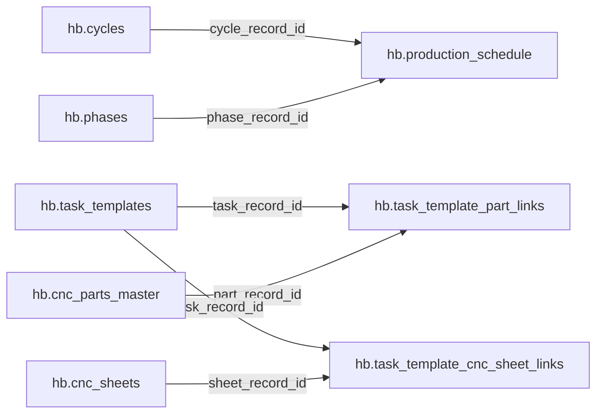

# Browse Hawley cloud data with DBeaver

Setup date: 2026-09-17. Desktop: Windows profile `C:\Users\Ryan`. Client: DBeaver
Community 26.2.0 (free). Repository: `ProdEngineerBowlus/bowlus-hawley`.

## What this setup does

Connects the desktop directly to DigitalOcean Managed PostgreSQL, cluster
`hawley-pg-prod`, database `bowlus_ops`, using the existing `bowlus_readonly`
role. This is the cloud database, not `hawley_local_mirror` on SW_Machine.
No database role/grant changes, source sync runs, app deployments, firewall
changes, or new billable cloud resources are part of this setup.

Connection name: **Hawley Cloud - READ ONLY**.

## Open and explore

1. Open the **Hawley Database** desktop shortcut (opens DBeaver and the starter
   SQL file), or open DBeaver from the Windows Start menu.
2. Expand **Hawley Cloud - READ ONLY → Databases → bowlus_ops → Schemas**.
   The saved connection uses `bowlus_readonly` with DBeaver's stored credentials.
   Depending on navigator settings, the database level may be omitted.
3. Start with **hb → Tables** for normalized production data or
   **reporting → Views** for prepared reports.
4. Double-click a table/view, then choose its **Data** tab. Use filters to
   narrow the rows and Refresh to fetch current data.
   Expand folders using the small arrows to their left; double-clicking a folder
   can open its properties instead. **Properties** shows the column definitions;
   **Data** shows actual rows and columns like an Airtable grid. Scroll horizontally
   for additional columns. Close the Value panel or minimize AI Chat for more room.
5. Open `tools/reporting/hawley-dbeaver-starter.sql`, select the Hawley
   connection, and run an individual statement with **Ctrl+Enter**.
   The scripts use limits where appropriate and do not trigger source imports.

Good starting objects:

| Object | Use |
| --- | --- |
| `hb.production_schedule` | VIN, phase, cycle, and scheduled dates |
| `hb.task_templates` | Airtable-sourced task definitions and estimates |
| `hb.cnc_parts_master` / `hb.cnc_sheets` | CNC part and sheet reference |
| `hb.rev1_task_instances` | Production task instances |
| `reporting.task_template_bom` | Prepared task/part/material report |
| `reporting.actual_vs_estimated_by_phase` | Phase-level labor comparison |
| `reporting.worker_daily_utilization` | Worker utilization report |

## Relationship visualization

Open a table or schema editor and select **ER Diagram** to inspect its
structure. The live `hb` schema had **zero declared foreign keys** on the setup
date. Consequently, an automatic diagram will show tables but may not draw
relationship lines. Missing lines do not mean the tables are unrelated.

This map describes logical joins, not database-enforced constraints:



Use a custom DBeaver diagram/virtual relationship for local visualization if
needed. Do not create production foreign keys merely to draw diagram lines.
Some source relationships also live in arrays or JSON rather than SQL foreign
keys. Consult `docs/hawley-database-schema.md` and the actual column metadata.

## Installation and connection settings

Installed through WinGet, with installer hash verification:

```powershell
winget install --id DBeaver.DBeaver.Community --exact --source winget --silent --accept-package-agreements --accept-source-agreements
```

Executable: `%LOCALAPPDATA%\DBeaver\dbeaver.exe`.
Workspace: `%APPDATA%\DBeaverData\workspace6`.
Connection definition: `General\.dbeaver\data-sources.json` inside that workspace.

| Setting | Value/source |
| --- | --- |
| Driver | PostgreSQL (`postgres-jdbc`) |
| Host | Host from the approved `HAWLEY_CLOUD_DATABASE_URL` credential pointer |
| Port | `25060` |
| Database | `bowlus_ops` |
| Username | `bowlus_readonly` |
| Authentication | Username/password (`native`), credentials saved locally by DBeaver |
| JDBC SSL mode | `require` |
| Connection type | Production |
| DBeaver read-only | Enabled |

SSL `require` encrypts traffic; this setup does not claim CA/hostname verification.
For `verify-full`, obtain the cluster CA through the DigitalOcean database
connection panel and configure it explicitly before switching the mode.

## Credential handling

The existing Shop Ops `.env` key `HAWLEY_CLOUD_DATABASE_URL` is the credential
source pointer. Its value must not appear in GitHub, terminal output, screenshots,
or copied connection URLs in documentation.

The current connection uses DBeaver's local saved-credentials mechanism.
`General\.dbeaver\credentials-config.json` stores encrypted credential data;
`data-sources.json` records the connection and `save-password: true` without a
plaintext password. This is local application credential storage, not a claim
that Community Edition provides a master-password vault.

The initial PgPass setup was replaced after a reopen failure (see below).
Its obsolete Hawley entry and the one-time credential-import properties file
were removed. No plaintext database password was found in the connection JSON,
encrypted credentials file, or DBeaver workspace log during verification.
If credentials rotate, update the saved connection locally from the approved
credential source. Never commit credentials-config.json, secure storage,
credential-bearing workspace exports, bootstrap properties, or `.env` files.

## Reopen repair: 2026-09-17

After a normal app restart, DBeaver reported `Couldn't get password from PGPASS
file`, with the expected local file reported missing. The file was present in
filesystem checks; the precise reason DBeaver's file lookup failed was not
established. This occurred before connecting to PostgreSQL.

Changed the existing connection's authentication model to `native` and enabled
saved credentials, preserving the same read-only role, SSL URL, and connection
ID. Used DBeaver's documented `-vars` and `-con` interface for a one-time local
credential import; command arguments contained a variable reference, not the
password. Removed the temporary properties file before the restart test.

Verification: quit DBeaver completely, reopened without the credential-import
file or password arguments, and successfully fetched 200 production-schedule
rows at 07:52:37 Pacific. Either the normal DBeaver app or the Hawley Database
shortcut can use this saved connection. The desktop shortcut is a convenience,
not a separate database or an authentication requirement.

## Verification and access boundaries

Direct SQL checks on 2026-09-17 confirmed `current_database() = bowlus_ops`,
`current_user = bowlus_readonly`, and `pg_stat_ssl.ssl = true`.
The role is not superuser and cannot create roles or databases.

| Schema | Tables/views | Readable by this role | With table write privileges |
| --- | ---: | ---: | ---: |
| `hb` | 20 | 20 | 0 |
| `reporting` | 30 | 30 | 0 |
| `ops` | 2 | 2 | 0 |
| `core` | 21 | 8 | 0 |
| `raw` | 21 | 2 | 0 |
| `sync` | 8 | 3 | 0 |

The table-privilege check covers INSERT/UPDATE/DELETE/TRUNCATE on these schemas;
it is not an audit of all function-execution privileges. Use the supplied SELECT
queries and browsing features. Restricted raw/core objects may be hidden or
return permission denied; that is expected. Do not replace this connection with
`doadmin` to get around those restrictions.

PostgreSQL JDBC driver 42.7.13 was downloaded through DBeaver's driver manager.
The user completed DBeaver's first-run preferences, including the data-collection
choice. These preferences are not imposed by this runbook.

DBeaver UI verification completed after the user entered the read-only username:
opened `hb.production_schedule` and its Data tab; the grid fetched 200 rows at
07:44 Pacific on 2026-09-17. The navigator was left expanded to `hb → Tables`.

All 10 statements in the starter SQL were executed successfully in a read-only
transaction with a 30-second statement timeout. The task-to-part join returned
zero rows at setup time; an empty result is not a connection failure. In the
same check, `hb.task_templates` had 929 rows, `hb.cnc_parts_master` had 1,052,
and `hb.production_schedule` had 312. The task/part bridge itself was empty;
this setup did not rebuild or repair it.

## Freshness means more than a successful connection

On 2026-09-17 the live health endpoint reported:

- Full Airtable pull: success at 01:01 Pacific, 14,161 records, zero errors.
- Full nightly refresh: exit code 0 at 01:07 Pacific.
- Asana-event and worker-actuals imports: successful around 07:20 Pacific.

These are timestamped observations, not an ongoing guarantee. General Airtable
planning imports run overnight; selected operational watchers run more often.
Hawley also writes selected actuals/averages back to Airtable. Do not assume all
Postgres tables should exactly equal Airtable or that a recent HB rebuild means
every source field was just re-imported. The freshness query reports source and
normalization timestamps separately. A record-level equality audit was not run.

Live diagnostic endpoint:
`https://bowlus-hawley-9s6iw.ondigitalocean.app/api/health`.
The `/api/sync-status` endpoint required authentication during this check.

## Troubleshooting and removal

- Driver prompt: download the PostgreSQL JDBC driver when DBeaver requests it.
- Authentication failure: verify the saved connection uses Username/password,
  `bowlus_readonly`, and current locally saved credentials. Do not paste passwords
  into issue reports. A PgPass-file error indicates the superseded setup.
- Connection timeout: verify network reachability and the cluster's trusted
  sources. This setup did not broaden DigitalOcean network access.
- Slow report: narrow by date/phase; avoid unbounded exports of large views.
- No diagram arrows: the `hb` model has logical links rather than declared FKs.
- To remove: disconnect and delete only this named DBeaver connection and its
  saved credentials. No cloud resource needs deletion.

## References

- [DBeaver Community download](https://dbeaver.io/download/)
- [Connection JSON format](https://dbeaver.com/docs/dbeaver/Data-Sources-Json-Reference/)
- [PgPass authentication](https://dbeaver.com/docs/dbeaver/Authentication-PostgreSQL-Pgpass/)
- [DigitalOcean PostgreSQL connections](https://docs.digitalocean.com/products/databases/postgresql/how-to/connect/)
- [DBeaver diagrams](https://dbeaver.com/docs/dbeaver/ER-Diagrams/)
